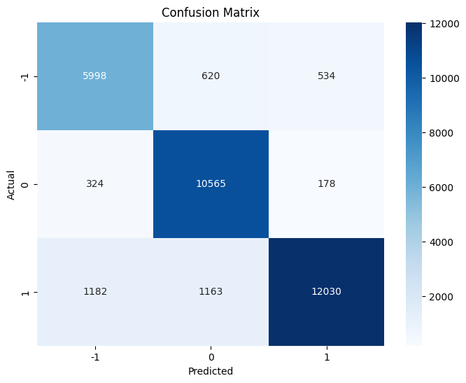

# Tweet Sentiment Analysis

A Python-based machine learning project to predict the sentiment of tweets as Negative (-1), Neutral (0), or Positive (1).

## Features
- Text preprocessing (URL/mention removal, tokenization, lemmatization).
- TF-IDF vectorization for feature extraction.
- Logistic Regression model with class balancing.
- Evaluation metrics and confusion matrix visualization.
- Example prediction for custom tweets.

## Installation

1. **Clone the repository**:
   ```bash
   git clone https://github.com/your-username/tweet-sentiment-analysis.git
   cd tweet-sentiment-analysis
   ```

2. **Install dependencies**:
   ```bash
   pip install pandas nltk scikit-learn matplotlib seaborn
   ```

3. **Download NLTK resources**:
   ```python
   import nltk
   nltk.download(['punkt', 'stopwords', 'wordnet'])
   ```

## Dataset
- Format: CSV file with columns `tweet` (text) and `category` (sentiment: -1, 0, 1).
- Example:
  ```
  tweet,category
  "when modi promised...",-1
  "talk all the nonsense...",0
  ```
- Place your dataset as `Twitter_Data.csv` in the project directory.

## Usage
1. **Run the script**:
   ```bash
   python sentiment_analysis.py
   ```

2. **Output**:
   - Model accuracy and classification report.
   - Confusion matrix visualization.
   - Sample prediction:
     ```
     Sample Tweet: I really enjoyed the conference! The speakers were fantastic.
     Predicted Sentiment: Positive
     ```

## Model Performance
### Evaluation Metrics
- **Accuracy**: 87.72%
- **Classification Report**:
  | Class | Precision | Recall | F1-Score |
  |-------|-----------|--------|----------|
  | -1    | 0.80      | 0.84   | 0.82     |
  | 0     | 0.86      | 0.95   | 0.90     |
  | 1     | 0.94      | 0.84   | 0.89     |

### Confusion Matrix
| Actual \ Predicted | -1   | 0     | 1     |
|--------------------|------|-------|-------|
| **-1**             | 1998 | 529   | 534   |
| **0**              | 324  | 10565 | 178   |
| **1**              | 1182 | 1163  | 12030 |



## Code Structure
1. **Text Preprocessing**:
   - Lowercasing, URL/mention/hashtag removal.
   - Tokenization, stopword removal, lemmatization.
2. **Model Training**:
   - TF-IDF vectorization with 5000 features.
   - Logistic Regression with balanced class weights.
3. **Evaluation**:
   - Accuracy, precision, recall, and F1-score.
   - Heatmap visualization of the confusion matrix.

## License
MIT License. See `LICENSE` for details.
